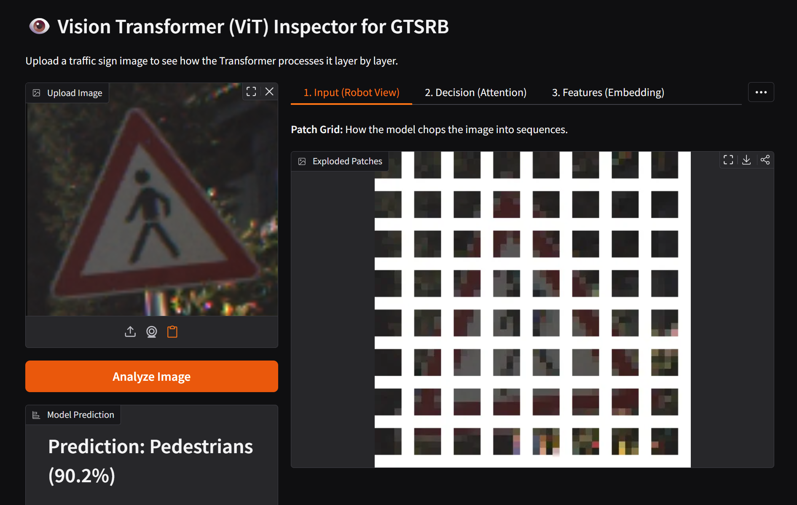
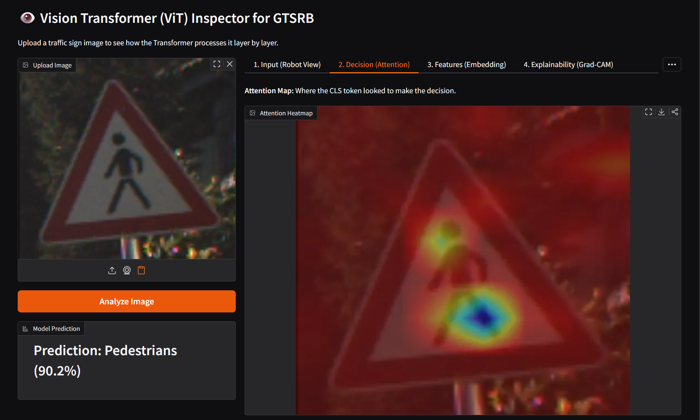
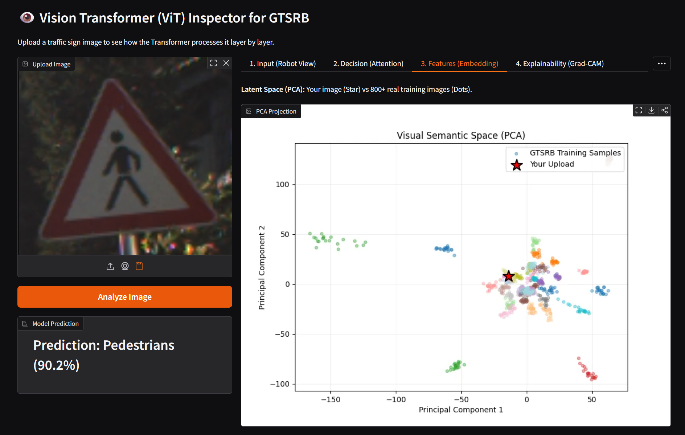
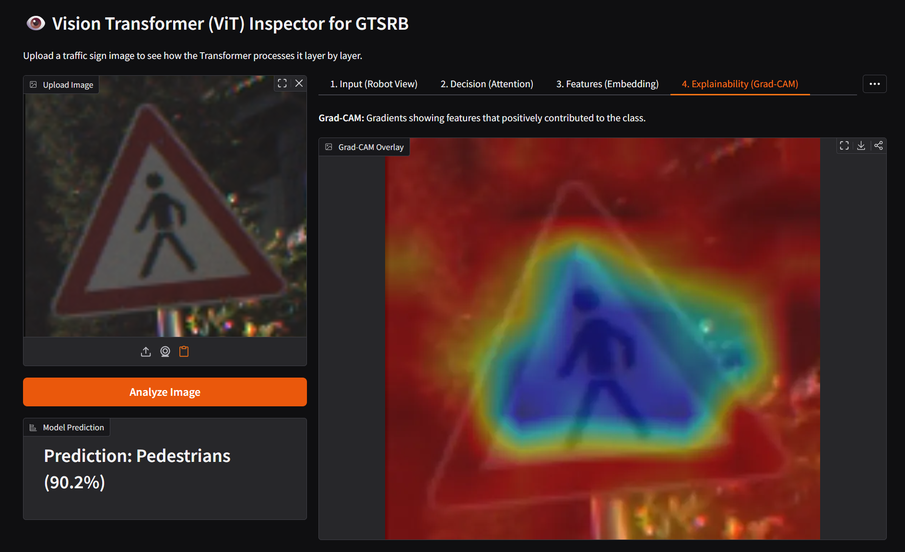
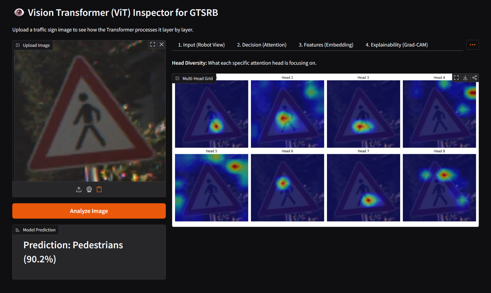

# ViT-From-Scratch - Vision Transformer on GTSRB

Brief: A PyTorch implementation of the original Vision Transformer (ViT) trained from scratch on the GTSRB traffic-sign dataset, plus a Gradio app that visualizes internals (patches, attention, PCA embedding, Grad-CAM, head diversity).

## Repository structure
```
├── notebooks/
│   └── ViT_experiment.ipynb 
├── src/
│   └── app.py                # Gradio app
├── models/
│   └── vit_gtsrb_clahe.pth    # Trained model checkpoint
├── data/
│   └── GTSRB/                # downloaded automatically
└── README.md
```

---

## Dataset
This project uses the GTSRB dataset. The notebooks and app call torchvision.datasets.GTSRB and will download data into `./data`.

* Images are resized to **32×32**
* 43 traffic-sign classes
* Downloaded automatically into `./data`

## Training
The ViT is trained **from scratch** (no ImageNet pretraining) using PyTorch.


### Key hyperparameters

| Parameter | Value |
|---|---:|
| IMAGE_SIZE | 32 |
| PATCH_SIZE | 4 |
| HIDDEN_SIZE | 384 |
| TRANSFORMER_BLOCKS | 10 |
| ATTENTION_HEADS | 8 |
| BATCH_SIZE | 512 |
| EPOCHS | 80 |
| LR | 6e-4 |
| WEIGHT_DECAY | 0.05 |
| LABEL_SMOOTHING | 0.1 |

### Data augmentation

To make training robust on such small images:

* CLAHE (contrast enhancement)
* Random rotations
* Random crops

The full training pipeline lives in
`notebooks/ViT_experiment.ipynb`.

## Model (high level)
- PatchEmbedding: Conv2d to create flattened patch tokens.
- TransformerEncoder: LayerNorm -> MultiHeadAttention -> Residual -> MLP with GELU -> Residual.
- CLS token + position embeddings; classification via an MLP head on CLS embedding.

## Visualization app

The heart of this project is an interactive Gradio app that lets you **step inside the model**.

Launch it via:

```bash
python src/app.py
```

Make sure the trained checkpoint exists at:

```
models/vit_gtsrb_clahe.pth
```

---

## Input Level

> *How does a Vision Transformer actually see an image?*

Before any prediction is made, the input image is **chopped into fixed-size patches**.
This view explodes the image into a grid of patches, making it clear that:

> A ViT does **not** see pixels, it sees a **sequence of visual tokens**, just like words in a sentence.




---

## Decision Level - *Attention Maps*

> *Where does the model look to make its decision?*

This view visualizes the **CLS token’s attention** over the image.
Bright regions indicate patches that contributed most to the final prediction.



You can clearly see the model focusing on:

* The **pedestrian symbol**
* The **triangular sign structure**

---

## Feature Space - *Latent Embeddings (PCA)*

> *Where does your image live among thousands of others?*

Here, the CLS embedding is projected into 2D using **PCA**, alongside embeddings from real training samples.

* Each dot → a training image
* Star → your uploaded image



This view shows how the model has **organized traffic signs semantically**, clustering similar signs together in latent space.

---

## Explainability - *Grad-CAM for Transformers*

> *Which features positively influenced the prediction?*

Grad-CAM highlights regions whose activations most strongly support the predicted class.



Despite being a transformer (not a CNN), the model still produces **spatially meaningful explanations**, focusing on the pedestrian figure rather than background clutter.

---

## Attention Head Diversity

> *Do different attention heads learn different things?*

This view breaks down attention **per head** in the final transformer block.



You’ll notice:

* Some heads focus on **shape**
* Others on **symbols**
* Some attend to **edges or corners**

This diversity is exactly what makes multi-head attention powerful.